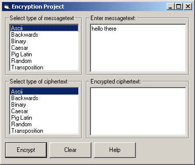



## Six Popular Encryption Methods

### Description

6 popular methods of encryption including: Backwards, Binary, Caesar, Pig Latin, Random, and Transposition.

The beauty of this program is you can encrypt/decrypt from one type of encryption to another (you don't always have to start out with ascii).

For example, you can enter binary code and translate that into pig latin with one click!
 
### More Info
 
1. Choose what type of text is in the top textbox by selecting the appropriate type in the top listbox.

Ex. If you entered binary code into the top textbox, choose Binary from the top listbox.

2. Choose what type of encryption you want to use to convert the text.

It may be a little hard to understand at first, but read the help and it should make things clearer.

The encrypted text

None. The only error returned is if you encrypt 'Random' text when it really isn't Random.

             |
---                |---
**Submitted On**   |2000-11-01 15:14:16
**By**             |[Noah Spitzer\-Williams](https://github.com/Planet-Source-Code/PSCIndex/blob/master/ByAuthor/noah-spitzer-williams.md)
**Level**          |Intermediate
**User Rating**    |4.1 (29 globes from 7 users)
**Compatibility**  |VB 4\.0 \(16\-bit\), VB 4\.0 \(32\-bit\), VB 5\.0, VB 6\.0, VB Script
**Category**       |[Encryption](https://github.com/Planet-Source-Code/PSCIndex/blob/master/ByCategory/encryption__1-48.md)
**World**          |[Visual Basic](https://github.com/Planet-Source-Code/PSCIndex/blob/master/ByWorld/visual-basic.md)
**Archive File**   |[CODE\_UPLOAD112041112000\.zip](https://github.com/Planet-Source-Code/noah-spitzer-williams-six-popular-encryption-methods__1-12461/archive/master.zip)

